# Introduction

>Unfortunately, there have been reports of unauthorized sales of this computer on platforms like Tindie, AliExpress and othe obscure chinese Marketplaces. We kindly ask you to support and reward the original creators of this project, who have generously shared their work with the retro community, rather than those engaging in unauthorized distribution. Thank you for respecting the creators' efforts and intentions.

MSX computers hold a significant place in computing history, and their legacy continues to be celebrated through innovative approaches like FPGA synthesis. Field-Programmable Gate Arrays (FPGAs) provide a unique platform for recreating the MSX architecture, offering a flexible and efficient way to re-create the hardware. 

This synthesis enables enthusiasts to experience the charm of MSX systems without relying on original, often scarce, hardware components. FPGA-based MSX simulations can faithfully replicate the distinctive features of these iconic computers, including the Z80 processor, graphics capabilities, and sound architecture. 

This modern approach not only preserves the nostalgia associated with MSX but also opens up possibilities for enhancements and customizations. FPGA synthesis ensures that the MSX spirit endures, catering to both seasoned aficionados and new generations eager to explore the roots of personal computing.

> **WARNING!** If you use this project to implement your own hardware, remember as per the license you must release the modified files under the same license. I've seen multiple projects based on files I publish on Github that were never released to the public, and I think that's a shame (and violation of the license!).

# TRHMSX - A Simple FPGA MSX2+ clone

This FPGA-based MSX2+ hardware represents a straightforward implementation, drawing inspiration from the original 1chipMSX circuit but featuring several enhancements and a new PCB design for improved functionality. Despite its advanced capabilities, the primary focus during development was on maintaining a low-cost solution.

The core of this system is the Cyclone I FPGA, accompanied by a few additional components. The PCB is a 4-layer board measuring 12x15 cm. The FPGA is a 240-pin package, which is challenging to solder manually. Instead, using an SMT oven or a hot air station is advised for optimal results. For those opting for a hot air station, employing a stencil to apply solder paste is highly recommended, significantly streamlining the assembly process.

| Kicad 3D Model | TRHMSX Computer |
|---------|---------|
| 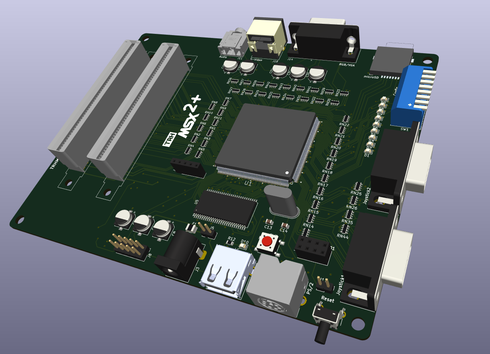 | .jpg) |

Programming the FPGA requires the well-known OCM-PLD ESE MSX2+ core maintained by @gnogni (aka KDL), available for download [here](https://gnogni.altervista.org/) with the main development repository located at https://github.com/gnogni/ocm-pld-dev. This core ensures the proper functioning of the MSX2+ hardware, providing users with a reliable and authentic MSX experience on this FPGA-based system.

## Features

* **MSX2+ Compatibility**: Reproducing the MSX2+ architecture, ensuring compatibility with a wide range of software and games.
* **Expanded Memory Options**: Choose between 2MB or 4MB of mapped RAM, providing users with flexibility for diverse computing needs and applications.
* **9958 Video Display Processor (VDP)**: Incorporating the 9958 VDP for sharp graphics and improved visual performance, delivering an authentic MSX experience.
* **S-Video or VGA/RGB Video Output**: Supporting S-Video output for enhanced video quality or VGA/RGB output for compatibility with modern displays.
* **FM and SCC Sound Capabilities**: Featuring FM synthesis and SCC sound to reproduce the iconic audio characteristics of MSX systems, enhancing the overall gaming and multimedia experience.
* **Programmable Sound Generator (PSG)**: Including the original PSG for standard MSX audio output.
* **Keyboard Compatibility**: Supporting modern USB or PS/2 keyboards, providing users with a choice for their preferred input device.
* **MicroSD Card Support**: Integrating a microSD card slot for convenient storage and easy access to files, games, and software.
* **MSX Cartridge Slots**: Equipped with two MSX cartridge slots, allowing users to explore a vast library of MSX cartridges for an extended range of applications and games.
* **Dual Joystick Ports**: Featuring two joystick ports for multiplayer gaming and compatibility with classic MSX peripherals.
* **Wireless Network Support**: Incorporating wireless network support through the ESP8266, enabling online connectivity and expanding the possibilities for networked applications.
* **12V Cartridge Lines**: Providing dedicated 12V lines for cartridges, ensuring compatibility with a variety of peripherals and accessories.
* **Customizable Case Design**: Offering a 3D-printed base and transparent acrylic top cover, allowing users to customize the appearance of their TRHMSX system.

## Open Source

This project stands as a testament to the spirit of open source collaboration. Over the years, the original 1chipMSX circuit has inspired numerous clones, some even commercially implemented, each potentially harboring unique modifications. Regrettably, many of these adaptations were never shared with the broader community. In response, this project emerges as a fresh implementation of the original circuit, introducing enhancements and a redesigned PCB.

What sets this initiative apart is its commitment to transparency. From the project's inception, the goal was clear: to share all design files openly. This includes not only the schematics and PCB layout but also the Bill of Materials (BOM) and any other essential documentation for recreating the project.

In contrast to its predecessors, this project was conceived with a dedication to community collaboration. If you choose to utilize these resources to construct your own MSX2+ clone or find ways to enhance it, I encourage you to contribute back to the community. 

Share your experiences, document any improvements you make, and actively participate in the collective evolution of this open source initiative.

Let this project serve as a reminder of the **reciprocal nature of open source**. By using and benefiting from open source projects, it becomes a responsibility to give back, ensuring the continued growth and enrichment of the shared knowledge pool within the community.

## Bill of materials

The following table provides a comprehensive list of components required to build the latest version of the TRHMSX project. The BOM details the components, quantities, and references for each part.

I also provide links to the components on AliExpress or other sources, making it easier for you to purchase the necessary parts. 

 > **Note:** I don't have any affiliation with the sellers or guarantee the quality of the products. Please make sure to check the specifications and compatibility of the components before purchasing them.

| **Reference** | **Value** | **Description** | **Qty** | **Link** |
|---------------|-----------|-----------------|---------|----------|
| **PCB**       |           |                 |         |          |
| TRHMSX PCB    | N/A       | Custom Printed Circuit Board for the TRHMSX 1.51 | 1 | [Gerber Files](hardware/trhmsx/production/TRHMSX_-_The_simple_MSX2_clone_in_FPGA_1.51.zip) |
| **Integrated Circuits (ICs)** | | | | |
| U1            | EP1C12Q240C8N | FPGA Cyclone Family 12060 Cells 275.03MHz 130nm Technology 1.5V 240-Pin PQFP | 1 | [AliExpress](https://s.click.aliexpress.com/e/_DEfxPNr) |
| U2            | AMS1117-1.5V | LOW DROPOUT VOLTAGE REGULATOR (1.5V) | 1 | [AliExpress](https://s.click.aliexpress.com/e/_DEu6go1) |
| U3            | AMS1117-3.3V | LOW DROPOUT VOLTAGE REGULATOR (3.3V) | 1 | [AliExpress](https://s.click.aliexpress.com/e/_DEu6go1) |
| U4            | NC7WZU04P6X | Dual Unbuffered Inverter | 1 | [AliExpress](https://s.click.aliexpress.com/e/_Dk6F9y9) |
| U5            | MT48LC16M16A2TG | 256Mb (4 Megabit x 16 x 4 banks) SYNCHRONOUS DRAM | 1 | [AliExpress](https://s.click.aliexpress.com/e/_DmOI4S5) |
| U6            | M51953BFP | Voltage Detector and System Reset IC | 1 | [AliExpress](https://s.click.aliexpress.com/e/_DnqwGxB) |
| U7            | CH559T | USB Host Micro-controller | 1 | [AliExpress](https://s.click.aliexpress.com/e/_oBU50ZV) |
| U8            | EPCS4 | 4 Mbit Serial Flash Memory (Altera Configuration) | 1 | [AliExpress](https://s.click.aliexpress.com/e/_DD2sMq9) |
| **Resistors** |           |                 |         |          |
| RN27, RN28, RN29, RN30, RN31, RN32, RN33, RN34 | 200R | 0603X4 200R Resistor Array | 8 | [AliExpress](https://s.click.aliexpress.com/e/_DFFkTit) |
| RN1, RN2, RN3, RN4, RN5, RN6, RN7, RN8, RN9, RN10, RN11, RN13, RN14, RN15, RN16, RN19, RN20, RN21, RN22, RN23, RN36, RN37, RN38, RN39, RN40, RN41, RN42, RN43 | 100R | 0603X4 100R Resistor Array | 28 | [AliExpress](https://s.click.aliexpress.com/e/_DFFkTit) |
| RN12, RN25, RN26, RN35, RN44 | 10KR | 0603X4 10K R Resistor Array | 5 | [AliExpress](https://s.click.aliexpress.com/e/_DFFkTit) |
| RN17, RN18, RN24 | 1KR | 0603X4 1K R Resistor Array | 3 | [AliExpress](https://s.click.aliexpress.com/e/_DFFkTit) |
| R5, R12 | 1KR | 0805 1KR Resistor | 2 | [AliExpress](https://s.click.aliexpress.com/e/_DDTBoqV) |
| R13, R14 | 2.2KR | 0805 2.2KR Resistor | 2 | [AliExpress](https://s.click.aliexpress.com/e/_DDTBoqV) |
| R1, R2 | 10KR | 0805 10KR Resistor | 2 | [AliExpress](https://s.click.aliexpress.com/e/_DDTBoqV) |
| R3, R7 | 10R | 0805 10R Resistor | 2 | [AliExpress](https://s.click.aliexpress.com/e/_DDTBoqV) |
| R8, R9 | 100R | 0805 100R Resistor | 2 | [AliExpress](https://s.click.aliexpress.com/e/_DDTBoqV) |
| R10 | 22R | 0805 22R Resistor | 1 | [AliExpress](https://s.click.aliexpress.com/e/_DDTBoqV) |
| R11 | 1MR | 0805 1MR Resistor | 1 | [AliExpress](https://s.click.aliexpress.com/e/_DDTBoqV) |
| **Capacitors** |           |                 |         |          |
| C2, C3, C4, C6, C7, C9, C10, C11, C12, C15, C16, C17, C18, C19, C20, C21, C22, C23, C24 | 0.1uF | 0805 100nF Ceramic Capacitor (104) | 19 | [AliExpress](https://s.click.aliexpress.com/e/_Dkt1yD7) |
| C13, C14 | 27pF | 0805 27pF Ceramic Capacitor (270) | 2 | [AliExpress](https://s.click.aliexpress.com/e/_Dkt1yD7) |
| C26, C27 | 4.7uF | 0805 4.7uF Ceramic Capacitor (475) | 2 | [AliExpress](https://s.click.aliexpress.com/e/_Dkt1yD7) |
| C33, C34 | 3.3uF | 0805 3.3uF Ceramic Capacitor (335) | 2 | [AliExpress](https://s.click.aliexpress.com/e/_Dkt1yD7) |
| C25 | 2.2uF | 0805 2.2uF Ceramic Capacitor (225) | 1 | [AliExpress](https://s.click.aliexpress.com/e/_Dkt1yD7) |
| C35 | 10uF | 0805 10uF Ceramic Capacitor (106) | 1 | [AliExpress](https://s.click.aliexpress.com/e/_Dkt1yD7) |
| C1, C5, C8, C28, C29, C30, C31, C32 | 220uF | Electrolytic Capacitor SMD 220uF 10V | 8 | [AliExpress](https://s.click.aliexpress.com/e/_DFJZp0V) |
| **LEDs and Switches** |    |                 |         |          |
| D1, D2, D3, D4, D5, D6, D7, D8, D9, D10 | Any Color | LED 0805 SMD | 10 | [AliExpress](https://s.click.aliexpress.com/e/_DEuWUBP) |
| SW1 | DIP-SW-8P-RED-90G | Slide Type DIP Sided 90° Switch Module 8Pin Position Way 2.54mm Pitch Red Toggle Switch Blue Snap Switch Dial Switch | 1 | [AliExpress](https://s.click.aliexpress.com/e/_DdFF8Qd) |
| SW2 | BUTDIP90G6x6x12 | Momentary Tactile Tact Push Button Switch Right Angle Horizontal holder With Stent 6*6*12/mm | 1 | [AliExpress](https://s.click.aliexpress.com/e/_DdTON3T) |
| SW3 | BUTSMD180G6x6x4 | 6x6x4.3mm SMD Tactile Push Button Switch 4 Pin | 1 | [AliExpress](https://s.click.aliexpress.com/e/_ophZTzp) |
| **Connectors** |           |                 |         |          |
| J3 | DC-005 | Female DC Power Jack supply socket 5.5X2.5mm DC-005 5.5-2.5MM Barrel | 1 | [AliExpress](https://s.click.aliexpress.com/e/_DdYmFPj) |
| J11 | PJ-307 | 3.5mm Stereo Jack Socket Audio Jack Connector PCB 3F07 PJ-307 | 1 | [AliExpress](https://s.click.aliexpress.com/e/_DCBm6IH) |
| J4 | MICROSDCARDHOLDER-F | MICROSD Card Holder Card Slot Card Holder Mobile Phone Memory Card Holder With Self-Elastic Long And Short Body | 1 | [AliExpress](https://s.click.aliexpress.com/e/_DeHRUZx) |
| J7 | PS26P-B | Keyboard socket PS2 6P black socket 6-pin Connector | 1 | [AliExpress](https://s.click.aliexpress.com/e/_Dci00lF) |
| J14 | DH15-F-SHORT-B | DH15 DR15 VGA Adapter Socket 3Rows Blue Parallel Port 15 Pin D Sub 15 Way PCB 90 Degree Female Connector | 1 | [AliExpress](https://s.click.aliexpress.com/e/_DEoqLMl) |
| J13, J16 | EDGE-50P | Edge Card Connector PCB Gold Finger 50 Pin | 2 | [AliExpress](https://s.click.aliexpress.com/e/_DkkR9k9) |
| J1 | PH-254-S-F-40 | Round Hole Pin Header 2.54MM Pitch Row Female, Single Row 1x40P | 1 | [AliExpress](https://s.click.aliexpress.com/e/_oFPYktN) |

## Building

To build the project you will need the following tools and resources:

* [Quartus Prime Lite Edition](https://fpgasoftware.intel.com/?edition=lite)
* [Quartus Prime Programmer](https://fpgasoftware.intel.com/18.1/?edition=lite&platform=windows&download_manager=dlm3)
* [USB Blaster drivers](https://fpgasoftware.intel.com/18.1/?edition=lite&platform=windows&download_manager=dlm3)
* [OCM-PLD Pack](https://gnogni.altervista.org/ocm/20221127%20OCM-PLD%20Pack%20v3.9.1%20by%20KdL.7z)

To guide the building process I recommend use the interactive BOM available here [here](https://htmlpreview.github.io/?https://github.com/cristianoag/trhmsx/blob/main/hardware/trhmsx/bom/ibom.html). As you get all the required parts and PCB, use the interactive BOM to check the components and their placement.

## Programming

The programming of the TRHMSX is divided into four main parts: the FPGA, the wireless network module, the USB host micro-controller, and the microSD card.

### FPGA
The firmware for the TRHMSX is based on the first generation esemsx VHDL/Verilog code. You can download the latest packages from KDL page [here](https://gnogni.altervista.org/), or get the latest development versions directly from his GitHub [here](https://github.com/gnogni/ocm-pld-dev).

If you are downloading from the page, you will need the OCM PLD Pack file. Download it and unzip its content in a local file on your PC. If you decide to use GitHub, clone the repository to your PC.

After the unzip, go to the latest version folder and navigate to esemsx3 folder. Check the README file, you will see that you need a pretty old Quartus II version (v11.0 SP1). That is because you are using an obsolete Altera FPGA chip that cannot be programmed by recent versions of the software.

Scrolling down on KDL page you will see a link to download the right version of Quartus. Download and install it.

> **Note:** I had issues with driver certificates for the USB blaster after installing this old version of Quartus. My USB blaster stopped working as the certificates for the driver in v11 are already expired. I reinstalled the latest version of Quartus on the same PC and everything worked fine after that.

Follow the instructions on the README file to compile the appropriate files and program your FPGA. Make sure to follow the instruction to convert the programming file and incorporate the emsx_top_304k.cof file, that way you will have an MSX computer with the EPBIOS. Those steps ensure that you will have the basic BIOS together with the programming file stored on the EPCS4, that will be useful in case you have any issues with the microSD card slot.

Connect your USB Blaster cable and use the Quartus programmer tool to upload the programming file to the EPCS4 flash.

When you turn on your TRHMSX after assembling the PCB, all LEDs should lit. During programming they will flash, turn off and after boot, the TRHMSX will flash the last LED indicating it is loading the synthesis to the FPGA chip, then it will lit only the LEDs that are correspondent to the configuration on the DIP switch bank.

Turn on 2 and 3 to have a 31Khz video and the last one (8) so you enable the SD card. If you need to understand what each dip switch does, check the doc file that is available [here](/docs/TRHMSX_1.5_Quick_Guide_EN.docx).

### USB Host Micro-controller

The latest version of the TRHMSX uses a CH559T micro-controller to handle the USB keyboard interface. That offers the possibility to use almost any USB keyboard with the computer, and not only the ones compatible with the PS/2 protocol.

The circuit from the [HIDMAN micro project](https://github.com/serisman/HIDman-mini/tree/main/KiCad%20PCBs/HIDman-micro) by [@serisman](https://github.com/serisman), based on the [original HIDMAN project](https://github.com/rasteri/HIDman/tree/main) by [Andy (@rasteri)](https://github.com/rasteri) was implemented on the computer. The solution uses the CH559T microcontroller from WCH (Nanjing QinHeng Electronics), a versatile 8051-based chip designed for USB applications.

The HIDMAN micro hardware and firmware offer a reliable way to adapt USB keyboards for PS/2 devices. Open-source hardware truly shines here, allowing to build on the amazing work of the community. Huge thanks to @rasteri and @serisman for their contributions!

To enable USB keyboard support, you’ll need to program the CH559 microcontroller. Here’s how:

1. **Prepare Your Tools**:
    * Download the WCH ISP Tool from [WCH’s website](https://www.wch-ic.com/downloads/WCHISPTool_Setup_exe.html) or from the TRHMSX GitHub repository if needed. I have a copy of the tool available [here](/software/WCHISPTool_Setup.exe).
    * If you are using macOS or Linux, install the [ch55xtool](https://github.com/MarsTechHAN/ch552tool).

2. **Connect Your Hardware**:
    * Power off the TRHMSX.
    * Use a USB A-to-A cable to connect the TRHMSX to your computer.

3. **Program the MCU**:
    * Launch the WCH ISP Tool and select the E8051 USB MCUs family.
    * Ensure the CH559 model is detected. If it isn’t, check the chip installation or bootloader status.
    * Download the pre-configured firmware for TRHMSX from the GitHub repository [here](/hardware/hidman-micro/firmware/dist/hidman.hex).
    * Follow the tool’s prompts to upload the firmware. Please refer to the following images for the tool configuration.

| WCH ISP Configuration| Firmware Download |
|---------|---------|
|  |  |

### Wireless Network Module

Wireless network access in the TRHMSX is performed by the use of a 8266 ESP-01 module by Espressif and via the ESP8266 Wi-Fi Support Pack v1.0 shared by KDL as the result of the work of Oduvaldo Pavan Jr. The software created by Oduvaldo is licensed under the GNU Lesser General Public License v2.1 as open source and it is available both from the KDL original web page as well as directly from Oduvaldo's GitHub repository at https://github.com/ducasp/ESP8266-UNAPI-Firmware/ 

Note: Oduvaldo has been working in optimized versions of the ESP8266 module to be used with other FPGA based computers and those may not be compatible with the TRHMSX. Please use the one shared by KDL as it was built to be used with the basic Verilog/VHDL ESEMSX.

#### Programming the ESP8266 module

To program the ESP-01 module you will need a CH340 USB to ESP8266 ESP01 Serial Programmer like the one shown in the below picture. You can purchase one of those directly from AliExpress [here](https://www.aliexpress.com/item/32971145094.html?spm=a2g0o.order_list.order_list_main.30.768e1802iucYdq) (the link is also available on the Bill of Materials table in this document).

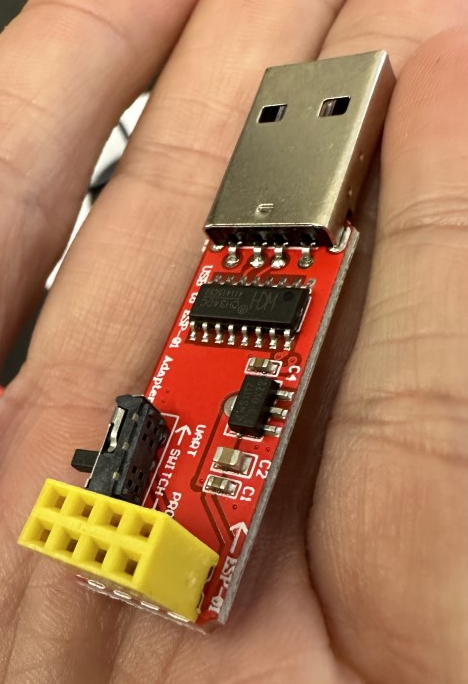

Follow the instructions detailed below to program your ESP8266 module:

1. Download the ESP8266 Wi-Fi Support Pack v1.0 from the KDL page [here](https://gnogni.altervista.org/ocm/20210823%20ESP8266%20Wi-Fi%20Support%20Pack%20v1.0%20by%20KdL.7z). 
2. Make sure the switch on the programmer is configured to PROG.
3. Connect the ESP-01 module to the programmer and insert it to your PC USB port. Open device manager and check the COM port assigned to the programmer. Make sure you have the appropriate CG340 driver installed, if required download and install the driver from wch.cn/downloads/CH341SER_EXE.html

&nbsp;&nbsp;&nbsp;&nbsp;&nbsp;&nbsp;&nbsp;&nbsp;&nbsp;&nbsp;&nbsp;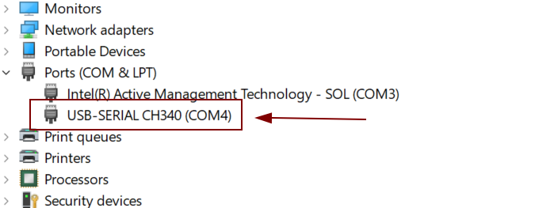

4. Download Espressif Flash Download Tools from Tools | Espressif Systems
5. Unzip and execute the Flash Download tool from the downloaded zip package. 
6. If asked, select the ESP8266 ChipType and Develop as the WorkMode. Click OK to run the flash download tool.

&nbsp;&nbsp;&nbsp;&nbsp;&nbsp;&nbsp;&nbsp;&nbsp;&nbsp;&nbsp;&nbsp;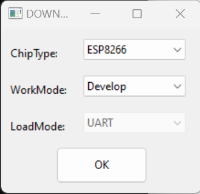

7. Click the elipsis on the first two lines and make sure to select certs.bin and fw.bin from the package downloaded from the KDL page. Those files are located on the bin folder after unziping the package.  Use 0x0 as the start address for fw.bin and 0xbb000 for certs.bin. Also make sure to select the same COM port as the port identified previously as being used by the CH340 programmer. Reference to the picture below when running the flash download tool to program your ESP8266 module.

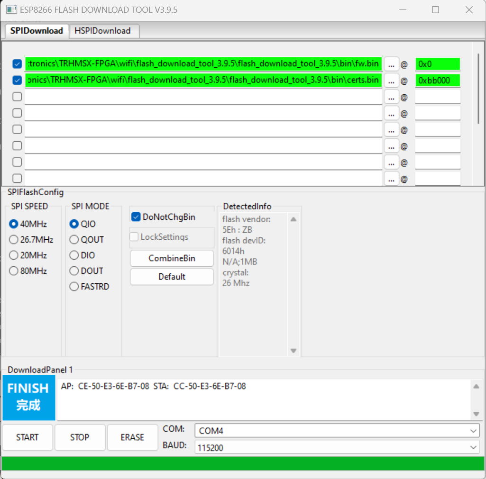

8. The ESP8266 is now ready to be inserted into the TRH MSX pin header dedicated to host the module.

#### Using the TRHMSX with Wireless 

To connect the TRHMSX to your wireless network you need first program the 8266 module according to the instructions previously documented. Then go ahead and plug the module to the appropriate pin headers on the board. Make sure you are connecting it with the right orientation. The location of the header was intentionally chosen to avoid wrong connections as the board cannot be over the SMD electrolytic capacitors located nearby.

Now turn on the TRHMSX and push the F1 key. Keep it pushed until you see the message shown below.

| Entering Network Setup | Config Menu|
|---------|---------|
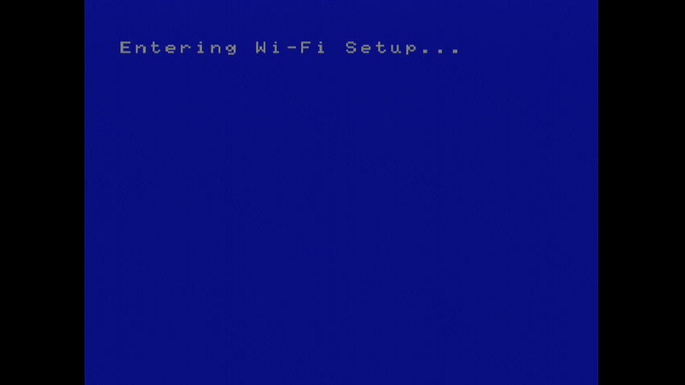|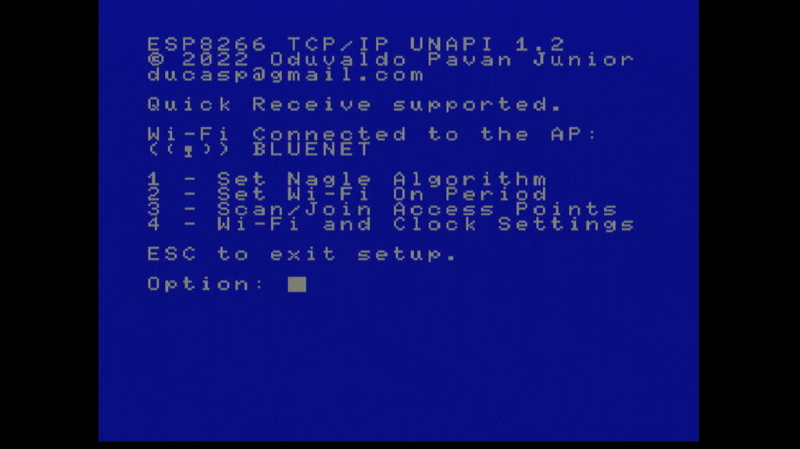|

Note that the second screen already shows it is connected to my local wireless network. You may get a message saying the module is still not connected to any access point. 

Using option 3 you can select a network to connect and provide appropriate credentials. The other options change specific firmware configurations. Please consult the firmware documentation to obtain details on the options and specific configurations.

After connecting the module to your wireless network you can use any UNAPI compatible tool from the computer. Just be aware that the AT firmware variant implemented by Oduvaldo doesn't support ICMP, thus the PING command that we normally use to test the OBSONETs and other traditional network cards will not work from the TRHMSX with the ESP8266 module.

### microSD Card

The microSD card is created by running two tools. The first will build the appropriate files for the card and the second will format, and copy the files to the card.

To configure the files for your microSD card, follow the steps below:

1. Download the latest version of the KDL OCM-SDBIOS pack from the KDL page [here](https://gnogni.altervista.org/).
2. Unzip the downloaded file to a local folder on your PC.
3. Open a command prompt and navigate to the folder where you unzipped the files.
4. Run the make-sdb.cmd tool that is located inside the "make" folder. 
5. Press ENTER on the first screen
6. On the Firmware Menu screen, select option 2 (default) and press ENTER
7. On the Disk-ROM Menu screen, select option 1 (default) and press ENTER
8. On the Main-ROM Menu screen, select option 2 (default) and press ENTER
9. On the Kanji-ROM Menu screen, select the option you want for the splash screen and press ENTER
10. On the Option-ROM Menu screen, select the option 2 to enable the ESP8266 Wifi BIOS for the TRHMSX and press ENTER.
11. On the Extra-ROM Menu screem, select option 3 (default) and press ENTER

Wait until the tool finishes creating the files. After that, you can folow the steps below to build the card using the files you just configured.

1. Insert the microSD card into your PC.
2. Run the SD Card building tool by executing the file named new-sdcard.cmd inside the "make" folder.
3. Select the drive corresponding to your microSD card and press Enter. Optionally provide a name for the partition.
 4. Press any key to create the partition and format the card.

After creating the microSD card, insert it into the TRHMSX and turn on the computer. The TRHMSX will boot from the microSD card and you will see the MSX-DOS prompt.

Optionally, install SofaRun and copy a few ROMs to the card to test the computer.

### +12V/-12V Cartridge Lines

Certain MSX cartridges utilize both the +12V and -12V lines, such as specific variants of OPL4 cartridges and the RBSC Carnivore2. Those lines are crucial for powering the operational amplifiers responsible for audio output.

In the case of the TRHMSX, the +-12V lines are generated through a simple DC Step-up Boost Converter module  connected to the relevant pin headers on the motherboard. 

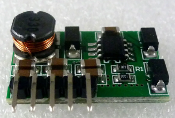

The board is powered by the 5V line from the TRHMSX and generates the required +-12V lines. The board is then connected to the TRHMSX motherboard through the relevant pin headers, providing the necessary power for cartridges requiring both +12V and -12V lines.

It can be ordered from AliExpress [here](https://www.aliexpress.com/item/32789671683.html?spm=a2g0o.order_list.order_list_main.16.36c21802vzMe7h).

## Case

The computer case is a combination of a 3D printed bed and a transparent acrylic top cover. There is also the option to print a top cover using transparent or translucid filament or resin. I'm providing Lightburn and STL files for either option on the case folder.

|3D model for the case|First prototype in the case|
|---------|---------|
|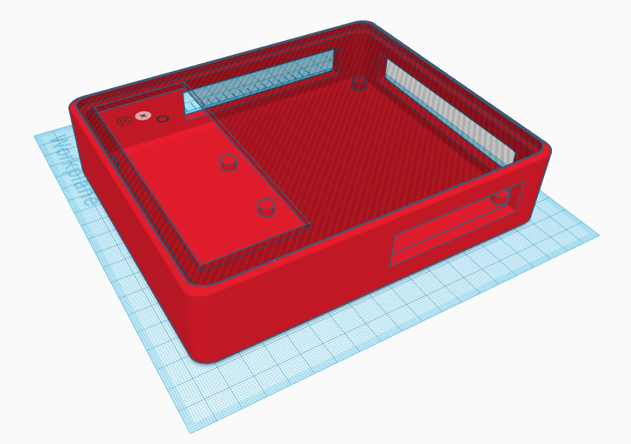|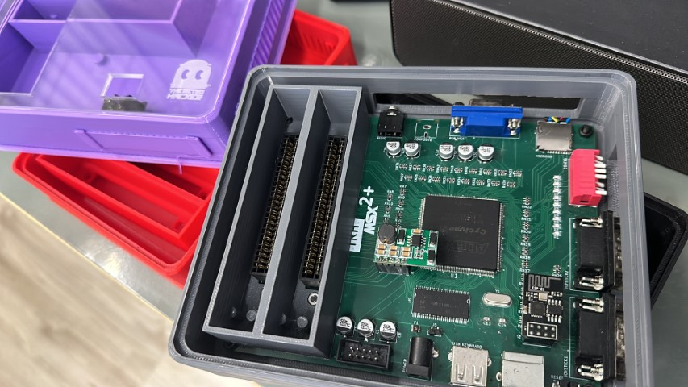|

The STL file to print the case is available [here](case/TRHMSX_case_base_v1.5.stl). You will also need the file to print the cartridge guide [here](case/TRHMSX_cart_guide_v1.4.stl).

Additionally I made available covers for all case and top cover holes so you can protect the computer from dust when not using it. Those files are available on the case folder as well.

The acrylic top is cut from a 3mm transparent acrylic sheet.
The SVG and Light Burn files to cut the acrylic top are available [here](case/). If you decide to print the top cover with the transparent filament or resin, please use the following STL file [TRHMSX_Translucent_Cover.stl](case/TRHMSX_Translucent_Cover.stl)

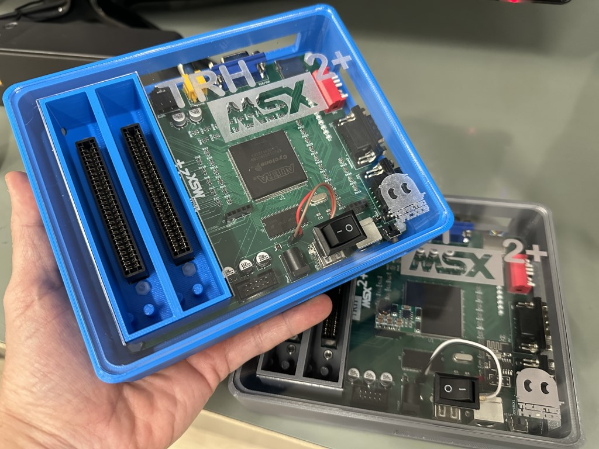

## License

This work is licensed under a [Creative Commons Attribution-NonCommercial-ShareAlike 4.0 International License](http://creativecommons.org/licenses/by-nc-sa/4.0/).

* If you remix, transform, or build upon the material, you must distribute your contributions under the same license as the original.
* You may not use the material for commercial purposes.
* You must give appropriate credit, provide a link to the license, and indicate if changes were made. You may do so in any reasonable manner, but not in any way that suggests the licensor endorses you or your use.

**ATTENTION**

This project was made for the retro community and not for commercial purposes. So only retro hardware forums and individual people can build this project.

THE SALE OF ANY PART OF THIS PROJECT WITHOUT EXPRESS AUTHORIZATION IS PROHIBITED!

